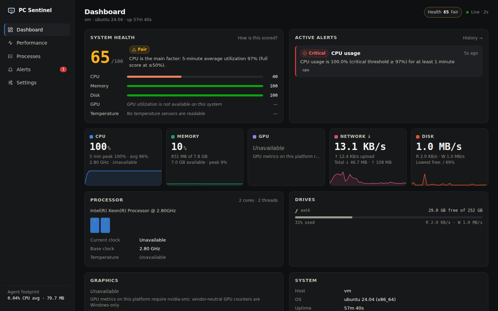
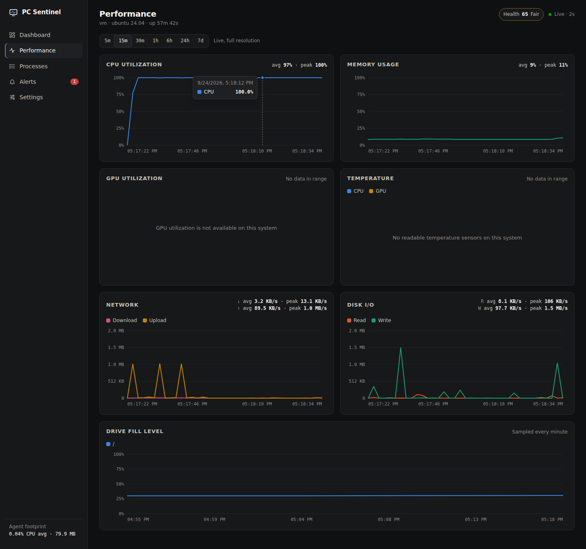
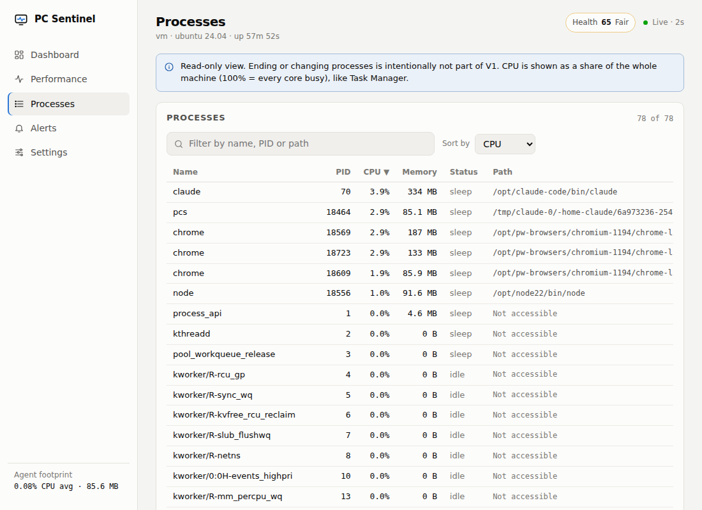
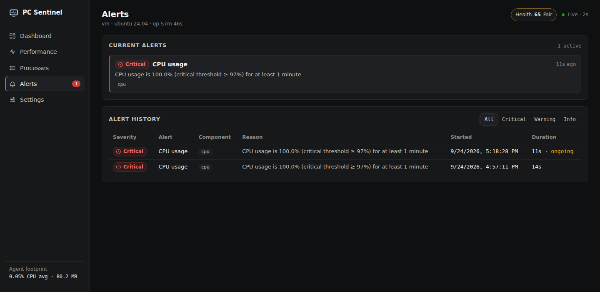
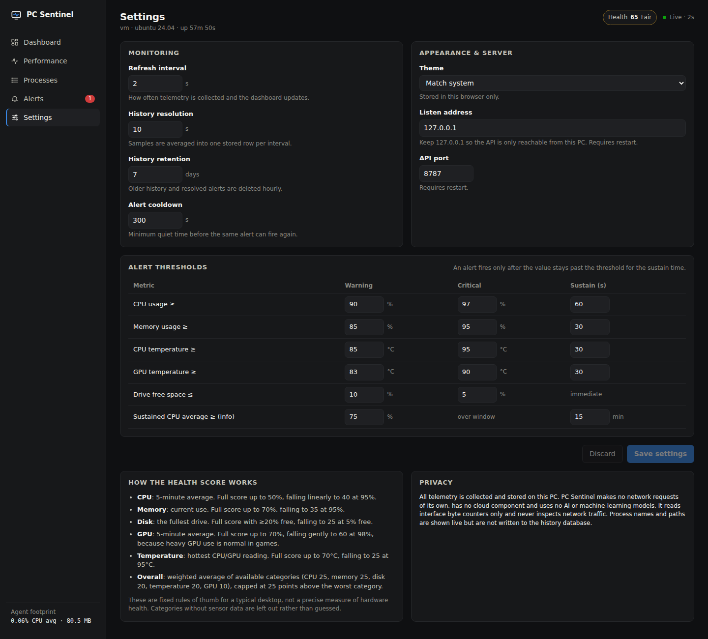

# PC Sentinel

PC Sentinel is a local system-health and performance monitor for Windows. A small Go agent collects CPU, memory, GPU, disk, network and process telemetry, scores system health with transparent rules, raises threshold-based alerts, and serves a React dashboard at `http://127.0.0.1:8787`. It gives you one clear view of your PC without juggling Task Manager, Resource Monitor and command-line tools.

> **V1 does not use AI.** There are no LLMs, cloud AI APIs or machine-learning models. All analysis is based on locally collected telemetry and fixed, documented rules.
>
> **Telemetry stays on your PC.** The agent listens only on `127.0.0.1`, makes no outbound network requests and has no cloud component. Nothing leaves the machine unless you later choose to export or share it yourself.



<details>
<summary>More screenshots</summary>

| Performance history | Processes |
| --- | --- |
|  |  |
| **Alerts** | **Settings** |
|  |  |

Mobile-width layout: [dashboard-light-390.png](docs/screenshots/dashboard-light-390.png)

</details>

_The screenshots are real output, captured on a Linux development VM (2 vCPU, no GPU, no temperature sensors) with an artificial CPU load running to trigger the alert. That is why GPU and temperature read "Unavailable". On a Windows PC those panels fill in where the hardware exposes the data._

---

## Contents

- [Features](#features)
- [Architecture](#architecture)
- [Technology stack](#technology-stack)
- [How telemetry is collected](#how-telemetry-is-collected)
- [How health scoring works](#how-health-scoring-works)
- [Alerts](#alerts)
- [History and retention](#history-and-retention)
- [API overview](#api-overview)
- [Configuration](#configuration)
- [Setup](#setup)
- [Development](#development)
- [Testing](#testing)
- [Performance of the agent itself](#performance-of-the-agent-itself)
- [Reliability behaviour](#reliability-behaviour)
- [Limitations](#limitations)
- [Privacy](#privacy)
- [Roadmap](#roadmap)

## Features

- **Dashboard.** Overall health score with per-category breakdown, active alerts, live tiles for CPU, memory, GPU, network and disk with 5-minute sparklines, per-core CPU load, drive capacity with low-space warnings, GPU adapter details, uptime, and the agent's own footprint.
- **CPU.** Total and per-core utilization, model, physical cores and threads, base clock, current clock (Windows: Task Manager-style effective speed), temperature where a sensor is readable, plus 5-minute peak and average.
- **Memory.** Total, used, available and percent used, with history and peak.
- **GPU.** A vendor-neutral path on Windows: adapter name, vendor, utilization, per-engine utilization (3D, Copy, Video Decode, …), and dedicated memory used and total. Temperature comes from `nvidia-smi` when it is installed; otherwise it shows as unavailable.
- **Disks.** Every local drive's capacity, used, free and percent, read/write throughput, and warning/critical badges when free space runs low. SSD health/SMART is **not** reported.
- **Network.** Download and upload rates, cumulative totals, and history. Only interface byte counters are read; packets are never inspected.
- **Processes.** Name, PID, CPU %, memory, executable path (when accessible) and status, with sorting and search. Read-only: terminating processes is deliberately **not** part of V1.
- **Performance page.** Historical charts for CPU, memory, GPU, temperatures, network, disk I/O and drive fill level over 5m / 15m / 30m / 1h / 6h / 24h / 7d, with average and peak for the selected range and a hover crosshair and tooltip.
- **Alerts.** Deterministic rules with sustain periods, hysteresis and cooldowns, shown with severity, timestamp, component and reason, plus stored alert history.
- **Settings.** Refresh interval, history resolution and retention, alert cooldown, all thresholds, and theme (dark / light / system), editable in the UI and saved to a JSON config file.
- **Single binary.** The built frontend is embedded in the Go executable with `go:embed`.

## Architecture

```
            ┌───────────────────────── pcsentinel.exe (Go) ──────────────────────────┐
            │                                                                         │
 Windows ──▶│  collector/  cpu · memory · gpu (PDH + DXGI) · disk · network · process │
 APIs       │      │  one Snapshot per interval (default 2 s)                         │
            │      ▼                                                                  │
            │  monitor/    loop · 30-min in-memory ring · 10 s averaging buckets      │
            │      │                 │                        │                       │
            │      ▼                 ▼                        ▼                       │
            │  analyzer/  health score + alert engine    storage/  SQLite (history,   │
            │                                                      disk usage, alerts)│
            │      │                                                                  │
            │      ▼                                                                  │
            │  api/        JSON over HTTP on 127.0.0.1:8787  +  embedded web/dist     │
            └──────┼──────────────────────────────────────────────────────────────────┘
                   ▼
            React + TypeScript dashboard (polls the API; pauses while the tab is hidden)
```

```
cmd/pcsentinel/        entry point: flags, wiring, graceful shutdown
internal/
  collector/           telemetry sources; *_windows.go holds PDH, DXGI and drive-type code
  analyzer/            health scoring, alert state machine, series summaries
  monitor/             collection loop, live ring buffer, downsampling, self-measurement
  storage/             SQLite schema, queries, retention pruning
  api/                 HTTP handlers and response types (dto.go)
  models/              telemetry types shared across layers
  config/              config file load/validate/save
web/
  src/components/      charts (hand-written SVG), tiles, panels, status pills
  src/pages/           Dashboard, Performance, Processes, Alerts, Settings
  src/hooks/           polling, hash routing, theme
  src/services/        typed API client
  src/types/           API response types
  src/lib/             formatting, sorting/filtering, chart math (unit-tested)
  embed.go             embeds web/dist into the Go binary
```

Design notes:

- **Collectors are isolated.** Each runs inside a guard that turns errors *and panics* into a per-component status, so a failing driver or missing sensor produces an "unavailable" field instead of a crash.
- **Unavailable is not zero.** Metrics that can't be read are `null` in JSON and show as "Unavailable" in the UI, often with a tooltip explaining why.
- **The API layer owns its response types** (`internal/api/dto.go`). Handlers depend on a small `Source` interface, which keeps them testable without real hardware.
- **No global mutable state** in PC Sentinel's code: rate baselines live on collector structs, shared state lives on the monitor behind a mutex, and configuration sits in a concurrency-safe store.

## Technology stack

| Layer | Choice | Why |
| --- | --- | --- |
| Agent | Go 1.24, standard library `net/http`, `log/slog`, `embed` | Small static binary, low overhead |
| System metrics | [gopsutil v4](https://github.com/shirou/gopsutil) | Mature, cross-platform CPU/memory/disk/network/process access |
| Windows specifics | `golang.org/x/sys/windows` calling PDH (`pdh.dll`) and DXGI (`dxgi.dll`) directly | Vendor-neutral GPU data without cgo or vendor SDKs |
| Storage | SQLite via [ncruces/go-sqlite3](https://github.com/ncruces/go-sqlite3) | Pure Go (WebAssembly build of SQLite), so no C compiler or DLL is needed on Windows |
| Frontend | React 19, TypeScript, Vite | No UI framework and no chart library: charts are ~200 lines of SVG |
| Tests | Go `testing` + `httptest`; Vitest for frontend logic | |

The frontend has two runtime dependencies (`react`, `react-dom`). The Go agent has three direct dependencies.

## How telemetry is collected

| Metric | Windows source | Notes / fallback |
| --- | --- | --- |
| CPU utilization (total, per core) | System CPU time counters (gopsutil → `GetSystemTimes` / `NtQuerySystemInformation`), differenced between samples | Computed by PC Sentinel from raw counters, not a library helper with hidden global state |
| CPU model, cores, threads, base clock | gopsutil `cpu.Info` / `cpu.Counts` | |
| CPU current clock | PDH `\Processor Information(_Total)\% Processor Performance` × base clock | Same method Task Manager uses. On Linux: `scaling_cur_freq` from sysfs |
| CPU temperature | WMI `MSAcpi_ThermalZoneTemperature` (via gopsutil) | Often needs admin rights and is often a motherboard zone rather than the CPU die, so the UI labels the source. Unavailable is common on Windows. Polled every 10 s, with a 5-minute back-off after failures |
| Memory | `GlobalMemoryStatusEx` (gopsutil) | "Used" = total − available, matching Task Manager's "In use" |
| GPU adapters | DXGI `IDXGIFactory1::EnumAdapters1` → name, vendor ID, dedicated VRAM, LUID | Software and remote adapters are skipped |
| GPU utilization, engines | PDH `\GPU Engine(*)\Utilization Percentage` (Windows 10 1709+, WDDM 2.x) | Summed per physical engine across processes. Adapter utilization = busiest engine, as in Task Manager |
| GPU memory used | PDH `\GPU Adapter Memory(*)\Dedicated Usage` | Joined to DXGI adapters by LUID |
| GPU temperature | `nvidia-smi` if installed (polled every 10 s) | No vendor-neutral Windows API exists, so AMD and Intel show "Unavailable" |
| Disks | Volume enumeration + `GetDiskFreeSpaceEx`; I/O from `IOCTL_DISK_PERFORMANCE` (gopsutil) | Only fixed and removable drives. Network shares and optical drives are skipped because querying them can block. Read-only volumes are ignored |
| Network | Interface byte counters (gopsutil) | Loopback excluded. Per-interface deltas, so an adapter reset only zeroes its own rate |
| Processes | Toolhelp snapshot + `OpenProcess(PROCESS_QUERY_LIMITED_INFORMATION)` per process (gopsutil) | CPU % = CPU-time delta ÷ (elapsed × logical cores). Collected **only while the Processes page is open**, cached for 1.5 s. Windows provides no per-process status through this API, so status shows "—" there |
| Uptime, host | gopsutil `host` | |

Non-Windows platforms (used for development and CI) share everything except the Windows GPU path; there, GPU data comes only from `nvidia-smi` if it is present.

## How health scoring works

Each category gets a score from 0 to 100 from a simple piecewise-linear rule: full marks up to a "good" level, then a linear fall to a floor at a "bad" level. The rules live in `internal/analyzer/health.go`, are covered by tests, and are also explained in the Settings page.

| Category | Input | Full score at | Floor at | Floor score | Weight |
| --- | --- | --- | --- | --- | --- |
| CPU | 5-minute average utilization | ≤ 50 % | ≥ 95 % | 40 | 25 % |
| Memory | Current % used | ≤ 70 % | ≥ 95 % | 35 | 25 % |
| Disk | Lowest free space across drives | ≥ 20 % free | ≤ 5 % free | 25 | 20 % |
| Temperature | Hottest of CPU / GPU | ≤ 70 °C | ≥ 95 °C | 25 | 20 % |
| GPU | 5-minute average utilization | ≤ 70 % | ≥ 98 % | 60 | 10 % |

- **Overall** is the weighted average of the categories that have data, renormalised over their weights, and then **capped at the worst category + 25**, so one critical problem (such as an almost-full system drive) can't be averaged away by four healthy categories.
- Categories without data (no GPU counters, no temperature sensor) are **excluded**, not guessed.
- Grades: ≥ 85 Good · ≥ 65 Fair · ≥ 40 Poor · otherwise Critical.
- The score always comes with a one-line explanation naming the main factor, e.g. *"CPU is the main factor: 5-minute average utilization 97% (full score at ≤50%)."*

These are rules of thumb for a typical desktop. The score is a quick summary of *load and headroom right now*, **not** a precise or scientific measure of hardware health, and it says nothing about component wear or failure risk.

## Alerts

| Rule | Condition (defaults) | Severity |
| --- | --- | --- |
| High CPU usage | ≥ 90 % for 60 s / ≥ 97 % for 60 s | warning / critical |
| High memory usage | ≥ 85 % for 30 s / ≥ 95 % for 30 s | warning / critical |
| Low disk space (per drive) | ≤ 10 % free / ≤ 5 % free | warning / critical |
| High CPU temperature | ≥ 85 °C for 30 s / ≥ 95 °C for 30 s | warning / critical |
| High GPU temperature (per adapter) | ≥ 83 °C for 30 s / ≥ 90 °C for 30 s | warning / critical |
| Sustained CPU load | 15-minute average ≥ 75 % | info |

The engine (`internal/analyzer/alerts.go`) is a small deterministic state machine designed to avoid alert spam:

- **Sustain.** The threshold must be breached on every sample for the whole sustain period. A single dip below resets the timer.
- **Escalation.** A warning that later sustains past the critical line is upgraded in place (same alert ID) rather than duplicated.
- **Hysteresis.** An alert resolves only once the value is clearly back to normal (10 points below the warning line for CPU, 5 for memory and temperatures, 1 for disk free space), so values hovering at the line don't flap.
- **Cooldown.** After resolving, the same rule stays silent for `alertCooldownSeconds` (default 300).
- **Vanished targets.** If a drive is unplugged or a sensor disappears, its open alert is resolved with a note instead of being left dangling.
- **Restarts.** Alerts left open when the agent stopped are closed at the next start ("closed at restart"), because their state can't be known.
- The sustained-load rule only evaluates once 90 % of its window has been observed.

Every alert records rule, component, target, severity, title, human-readable reason, value, threshold, start, last update and resolution time.

## History and retention

- Samples are collected every `sampleIntervalSeconds` (default 2 s) and kept at full resolution in memory for 30 minutes, which serves the 5m / 15m / 30m ranges and the rolling windows used for scoring.
- Every `historyIntervalSeconds` (default 10 s) the buffered samples are **averaged into one SQLite row**. Peak CPU and GPU within the bucket are kept in separate columns, so short spikes still show as peaks. That is about 8,640 rows per day.
- Drive fill level is written once per minute per drive.
- Ranges of 1h and longer are read from SQLite and bucketed server-side to about 300 points.
- **Retention:** every hour, samples, drive rows and *resolved* alerts older than `retentionDays` (default 7, max 90) are deleted.
- **What is stored:** numeric metrics, drive mount points, and alert records. Process names, paths and command lines are **never** written to disk. Hostname is only shown live.
- Location: `%APPDATA%\PCSentinel\history.db` (override with `-data-dir`).

## API overview

All endpoints are `GET` unless noted, return JSON, and are served only on the loopback interface. Unavailable metrics are `null`. Errors look like `{"error": "..."}`.

| Endpoint | Returns |
| --- | --- |
| `/api/system` | Everything the dashboard needs: host info, uptime, health report, CPU, memory, GPU, disks, disk I/O, network, active alerts, per-collector status, agent footprint |
| `/api/health` | Health report only |
| `/api/cpu?range=15m` | Current CPU stats + average/peak for the range |
| `/api/memory?range=15m` | Current memory stats + average/peak |
| `/api/gpu?range=15m` | GPU report (adapters, engines, availability reason) + average/peak |
| `/api/disks` | Drives with capacity, free %, space status and I/O rates |
| `/api/network?range=15m` | Current rates and totals + download/upload average/peak |
| `/api/processes` | Process list (read-only) |
| `/api/metrics?range=1h[&disks=1]` | Time series + per-metric summary; optional drive fill history |
| `/api/alerts?limit=200` | Active alerts (from memory) + stored history |
| `/api/settings` | Current configuration |
| `PUT /api/settings` | Update configuration (partial JSON is merged; validated; persisted) |

Ranges: `5m`, `15m`, `30m`, `1h`, `6h`, `24h`, `7d`. Before the first sample completes, telemetry endpoints return `503`. If the history database is unavailable, long ranges return `503` while live endpoints keep working.

```jsonc
// GET /api/cpu?range=5m (real response from the Linux dev VM, numbers rounded)
{
  "timestamp": "2026-09-24T17:23:10.085-04:00",
  "current": {
    "model": "Intel(R) Xeon(R) Processor @ 2.80GHz",
    "physicalCores": 2,
    "logicalCores": 2,
    "baseFrequencyMHz": 2800.258,
    "currentFrequencyMHz": null,   // not exposed by this VM -> null, never 0
    "usagePercent": 0.25,
    "perCorePercent": [0.99, 0],
    "temperatureC": null
  },
  "range": "5m",
  "summary": { "available": true, "avg": 0.69, "peak": 1.5, "current": 0.25 }
}
```

Security hardening, since any web page can try to reach `localhost`:

- The agent binds to `127.0.0.1` by default.
- Requests whose `Host` header isn't a loopback name are rejected, which blocks DNS-rebinding pages.
- CORS is not enabled.
- `PUT /api/settings` requires `Content-Type: application/json`, which a cross-site form can't send.
- Responses carry a strict CSP and `nosniff`.

## Configuration

Settings live in `%APPDATA%\PCSentinel\config.json`. The file is optional: missing fields keep their defaults, an invalid file is reported and defaults are used instead. See [`config.example.json`](config.example.json) (a test keeps it identical to the built-in defaults).

| Key | Default | Range | Notes |
| --- | --- | --- | --- |
| `listenAddress` | `127.0.0.1` | | Restart required |
| `port` | `8787` | 1–65535 | Restart required; `-port` flag overrides |
| `sampleIntervalSeconds` | `2` | 1–60 | Applied live |
| `historyIntervalSeconds` | `10` | sample interval–600 | Averaging bucket for SQLite |
| `retentionDays` | `7` | 1–90 | |
| `alertCooldownSeconds` | `300` | 0–3600 | |
| `thresholds.*` | see [Alerts](#alerts) | | `warning`, `critical`, `sustainSeconds`; `sustainedCpu` has `averagePercent`, `windowMinutes` (≤ 25) |

Command-line flags:

```
pcsentinel.exe [-data-dir DIR] [-config FILE] [-port N] [-open=false]
```

`-open` (default on Windows) opens the dashboard in your browser at startup.

## Setup

**Requirements:** Windows 10 1709+ or Windows 11 (x64), [Go 1.24+](https://go.dev/dl/), [Node.js 20.19+ or 22.12+](https://nodejs.org/) (for building the frontend).

```powershell
git clone https://github.com/dirirahmed/PC-Sentinel.git
cd PC-Sentinel

# 1. Build the dashboard (output goes to web/dist, which the Go binary embeds)
cd web
npm install
npm run build
cd ..

# 2. Build the agent
go build -trimpath -ldflags "-s -w" -o bin\pcsentinel.exe .\cmd\pcsentinel

# 3. Run it (opens http://127.0.0.1:8787)
.\bin\pcsentinel.exe
```

Stop with `Ctrl+C`. Buffered history is flushed and the database closed on shutdown. Running as Administrator is optional: it can make CPU temperature and a few protected process paths readable, but everything else works without it.

You can also cross-compile the Windows binary from Linux or macOS: `make windows`. A `Makefile` wraps the common commands for systems with `make`.

## Development

Run the agent and the Vite dev server side by side. Vite proxies `/api` to the agent and gives hot reload:

```powershell
go run ./cmd/pcsentinel -open=false     # terminal 1: API on :8787
cd web; npm run dev                     # terminal 2: UI on http://localhost:5173
```

If you build the Go binary without building `web/` first, it runs in API-only mode and logs a warning.

Formatting and checks:

```
gofmt -l .            # must print nothing
go vet ./...
cd web && npm run typecheck && npm run format
```

## Testing

```
go test ./...
go test -race ./...
go vet ./...
cd web && npm test
```

[`.github/workflows/ci.yml`](.github/workflows/ci.yml) runs the frontend build and tests, `go vet`, and `go test` on both `windows-latest` and `ubuntu-latest` (plus `gofmt` and `-race` on Linux), so the real collectors are exercised on a Windows host on every push.

What the tests cover:

- **analyzer:** scoring-rule boundaries, the worst-category cap, exclusion of unavailable categories, grade cut-offs, the alert sustain timer (including reset on a dip), escalation keeping the same ID, the hysteresis band, cooldown, resolution of vanished targets, rules skipped when sensors are missing, disk-space classification, and series summaries using peak columns.
- **collector:** counter-rate and counter-reset handling, CPU busy-time math, memory underflow protection, the Task-Manager-equivalent GPU engine aggregation (per-engine summing, clamping, multi-adapter), LUID formatting matching PDH names, `nvidia-smi` parsing including `[N/A]`, CPU sensor selection and ACPI labelling, sensor back-off, per-interface network deltas with adapter resets, partition filtering (bind mounts, read-only images), process CPU % with PID reuse, panic recovery, and **real collection on the host running the tests**.
- **storage** (temp databases): round-trip and bucketed averaging, peak preservation, retention pruning (keeping open alerts), alert upsert, restart cleanup, a corrupt database file, and a newer-schema guard.
- **monitor:** snapshot publication, alert persistence, downsampling arithmetic, continued monitoring during storage failures and recovery, live-only operation without a database, ring-buffer trimming, and window-coverage rules.
- **api** (`httptest`): 503 before the first sample, JSON shape and `null` for unavailable data, range summaries, graceful degradation when history fails, bad ranges and limits, settings validation and partial updates, restart-required reporting, rejection of foreign `Host` headers, the SPA fallback and asset caching.
- **config:** defaults, partial files, invalid values, threshold ordering, atomic persistence, and example-file parity.
- **frontend** (Vitest): formatting (including `null` → "Unavailable"), process filtering and sorting (unmeasured CPU always last), chart math (nice axis maxima in decimal and binary units, gaps in lines, nearest-point hover), status-tone mapping and hash routing.

## Performance of the agent itself

The agent reports its own footprint (average CPU since start, resident memory, collection time) in the sidebar and in the System panel, so you can check it on your own machine.

Measured results so far come from a **Linux development VM** (2 vCPU Intel Xeon @ 2.8 GHz, 7.8 GB RAM, about 80 processes), using default settings and reading `/proc/<pid>/stat` and `VmRSS`:

| Scenario | Agent CPU (share of whole machine) | Resident memory |
| --- | --- | --- |
| Idle, no dashboard open (120 s) | ~0.04 % | 28 MB |
| Dashboard open, 2 s polling (120 s) | ~0.08 % | 30 MB |
| Processes page open, 3 s polling (60 s) | ~0.42 % | 31 MB |

A full collection pass took about 1–2 ms on that VM. Treat these figures as indicative only: **they were not measured on Windows**, where WMI temperature queries, PDH GPU counters and per-process `OpenProcess` calls have different costs. Resident memory is dominated by the embedded SQLite (WebAssembly) runtime; the Go heap stays around 3–5 MB.

Design choices that keep overhead low:

- Process enumeration runs only while the Processes page is open.
- Temperature and `nvidia-smi` are polled every 10 s rather than every sample.
- History is downsampled before it is written.
- The UI stops polling when its tab is hidden.

## Reliability behaviour

| Situation | Behaviour |
| --- | --- |
| Sensor missing or access denied | Field is `null` and the UI shows "Unavailable"; failing sensors are retried after a 5-minute back-off |
| No GPU counters or no GPU | GPU report has `available: false` plus a reason; the GPU category is excluded from health |
| A collector errors or panics | Recovered; reported in `collectors[]` with the error; other metrics unaffected |
| Process exits during enumeration | Skipped; per-field failures (path, memory) leave that field empty |
| Recycled PID | CPU baseline keyed by PID *and* creation time, so no bogus spikes |
| Drive unplugged | Dropped from the next snapshot; its alerts resolve with "no longer reported" |
| Counter reset (adapter reconnect) | Rate reported as 0 for that interval instead of a huge value |
| Database corrupt, locked or unwritable | Agent keeps running with live data; history endpoints return 503; the error is shown in the System panel; writes resume automatically when the database recovers |
| Invalid config file | Logged; defaults used |
| Agent unreachable from UI | Banner, "Disconnected" indicator, last values kept, automatic retry |
| Second instance started | Fails fast on the port bind *before* touching the database |

## Limitations

- **Windows validation.** The Windows-specific code (PDH queries, DXGI adapter enumeration via COM vtables, drive-type filtering, PDH CPU clock) cross-compiles and passes `go vet` for `GOOS=windows`, and the parsing and aggregation logic behind it is unit-tested. However, V1 was developed and run end-to-end on Linux, so check GPU numbers against Task Manager on your hardware.
- **GPU temperature** is only available through `nvidia-smi` for NVIDIA cards. AMD and Intel GPU temperatures need vendor SDKs, which V1 doesn't use.
- **CPU temperature on Windows** is usually unavailable or approximate. The only built-in source is ACPI thermal zones, which often need admin rights and often measure the motherboard rather than the CPU die. Accurate readings need a kernel driver (as used by LibreHardwareMonitor); V1 deliberately avoids shipping one.
- **No SSD/HDD health (SMART).** Only capacity and throughput are reported.
- **Process status** isn't exposed by the Windows API used, so it shows "—" there. Protected processes may show no path or CPU value without elevation.
- **No process termination** or any other system modification in V1.
- Per-process GPU, disk and network usage aren't shown.
- History averages hide spikes shorter than the bucket, except for CPU and GPU, which keep bucket peaks. Memory peak for long ranges is the peak of the bucket averages.
- Single user and single machine. Binding to a non-loopback address is possible, but there is no authentication, so it isn't recommended.
- `web/` has no `package-lock.json` in the repository yet; the first `npm install` creates one, and it should be committed.

## Privacy

- All telemetry is collected, analysed and stored locally. There is no telemetry upload, no analytics, no update check and no AI service.
- The API is loopback-only by default, with host-header checks.
- Network monitoring reads per-interface byte counters only. It never captures or inspects packets, connections, hostnames or URLs.
- The history database holds numeric metrics, drive mount points and alert records. Process names and paths appear live in the UI but are never persisted.
- Deleting `%APPDATA%\PCSentinel` removes all stored data.
- If a future version adds any off-device feature, it will be opt-in and clearly labelled. V1 has none.

## Roadmap

- Validate and tune the Windows GPU and CPU-clock paths on a range of NVIDIA, AMD and Intel systems.
- Optional LibreHardwareMonitor integration for accurate CPU and GPU temperatures when the user has it installed.
- Per-process GPU, disk and network usage (via PDH `GPU Engine` pid instances and ETW).
- Export history to CSV and a "compare two time ranges" view.
- Run as a background service or tray app with Windows toast notifications for critical alerts.
- An installer (MSIX or WinGet manifest).
- Later, and strictly opt-in: optional recommendations built on top of the deterministic rules, possibly AI-assisted. V1 intentionally ships without any of this.
